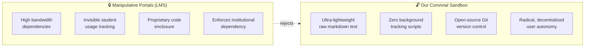
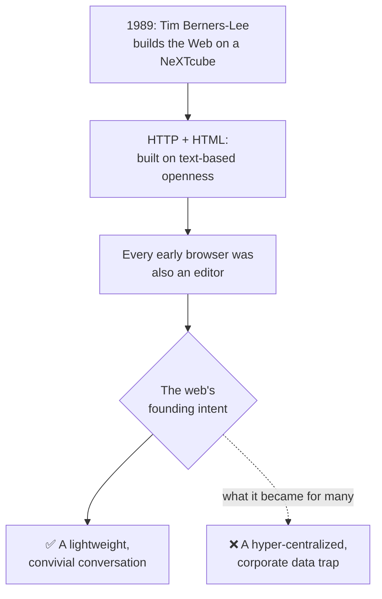

# Module 1: The Foundations of Decentralization & Minimal Computing

## 📖 Core Readings This Week
* **Ursula Franklin**, *The Real World of Technology*, Lecture 1: "Technology as Practice" — [Full text via Monoskop](https://monoskop.org/images/5/58/Franklin_Ursula_The_Real_World_of_Technology_1990.pdf)
* **Ivan Illich**, [*Tools for Conviviality*](https://archive.org/details/toolsforconvivia0000illi) — Introduction & Chapter 1: "Two Watersheds"
* **Retro Tech Show Case Study**, *[1989] NeXT Frontier: How Tim Berners-Lee Invented the Web on Steve Jobs' NeXT Workstation* — [Read on Medium](https://medium.com/@RetroTechShow/1989-next-frontier-the-definitive-story-of-how-tim-berners-lee-created-the-world-wide-web-710f52085501)
* **AU Press Open Collections**, *Critical Digital Pedagogy*, Chapter 7: "Digital Redlining, Minimal Computing, and Equity" — [Read the chapter](https://read.aupress.ca/read/critical-digital-pedagogy-in-higher-education/section/9dec9047-8272-49e7-8fdd-2e116d34a2e8#ch07)
* **Vatican Note**, *Antiqua et nova* (Sections 1–11: "Turing Tests and Discursive Reasoning") — [Official English text](https://www.vatican.va/roman_curia/congregations/cfaith/documents/rc_ddf_doc_20250128_antiqua-et-nova_en.html)

---

## 🧠 1. Theoretical Context: Materiality, Conviviality, and the War on Bloat

To understand the architecture of this course, we must confront the political and material realities of how software is deployed in higher education. We look at the history of computing through a dual framework: Tim Berners-Lee's original decentralized web protocol and modern **Minimal Computing** design principles.

This technical minimalism directly serves social philosopher **Ivan Illich's** core distinction between two kinds of tools:

> 🔓 **Convivial tools** — accessible, transparent infrastructures that give users the freedom to shape their environment with their own vision. They maximize individual liberty and require no corporate gatekeeper.

> 🔒 **Manipulative tools** — centralized, opaque systems that strip individuals of their agency, maximize consumer dependency, and mandate surveillance.

### 🛑 A. Digital Redlining vs. Minimal Computing
Modern corporate Educational Technology (EdTech) platforms are frequently agents of **digital redlining**. By building heavy, bloated web interfaces that require constant high-speed broadband connections, real-time tracking scripts, and up-to-date consumer hardware, institutions enforce invisible class boundaries that discriminate against specific student populations — turning education into a manipulative industry.

In direct response, we adopt a philosophy of **Minimal Computing** as an act of **technological ascesis**. Minimal computing asks four fundamental questions:

| # | Question |
|---|---|
| 1 | What do students actually need? |
| 2 | What are the cultural and material realities of their remote learning spaces? |
| 3 | How can our educational infrastructure be made safer, more accessible, and more private? |
| 4 | How do we reduce our computational footprint to minimize electronic waste and environmental extraction? |

Here's the split those four questions are pushing back against:

🔍 Go deeper: why "bandwidth" is a justice issue, not just a technical one

Digital redlining doesn't require anyone to intend harm. A platform that
assumes fast home broadband, a recent laptop, and an ad-free browsing
experience will quietly work fine for some students and quietly fail
others — and the failure looks like the student's fault ("why didn't you
just load the page faster?") rather than the platform's design choice.
Minimal computing treats hardware and bandwidth constraints as a design
input from the start, not an edge case to accommodate later.

### 🕸️ B. The 1989 Genesis Hook

This approach takes us straight back to the original architecture of the internet.

By stripping our course environment down to raw Markdown files and terminal Git pushes, we aren't using an outdated system; we are running a conscious act of resistance. We are applying minimal computing principles to bypass corporate trackers, protect student privacy, and build a localized workbench that preserves your digital sovereignty.

---

## 🛠️ Weekly Lab Evaluation Options

| | 💻 Developer Format | 🔍 Analyst Format |
|---|---|---|
| **What you do** | Build a lightweight script that generates a dependency-free HTML file | Audit a real platform against Illich's convivial/manipulative criteria |
| **Best for** | Students who want hands-on technical practice | Students who want to practice structural/critical analysis |
| **Output size limit** | Under 5 KB | — |
| **Deliverable** | Script + repository state | Forensic analysis report |

### 💻 The Developer Format: The Local Markdown Boilerplate

1. Initialize your local Git workspace repository. Author a clean, optimized shell script that automatically parses plain-text data fields to generate a formatted HTML file entirely free of external JavaScript dependencies or styles.
2. **Deliverable:** Commit your script and an initialized repository state to your repo. Prove that your output file size remains under 5 Kilobytes (KB) while rendering flawlessly inside a terminal-based web browser environment.

### 🔍 The Analyst Format: The Convivial Workspace Audit

1. Select a standard public-facing web platform or institutional portal enforced by an institution or business you interact with daily.
2. Run a comparative performance audit measuring it against Ivan Illich's definitions of **Convivial vs. Manipulative tools** and the criteria for **Digital Redlining**:
   - **The Bandwidth & Bloat Audit:** Use your browser's inspection panel to document the total page load size (in Megabytes), the number of network connections established, and the presence of third-party tracking pixels or student usage telemetry.
   - **The Enclosure Diagnostic:** Analyze how the platform's heavy layout punishes a user with limited bandwidth, or forces compliance to central institutional rules.
3. **Deliverable:** Commit a forensic analysis (`LAB-SUBMISSION.md`, copied from `LAB-SUBMISSION-TEMPLATE.md` — see the Student Guide) to your repository. Compare the platform's data footprint against our course's markdown repository structure, defending whether bloated design represents an accidental software choice or an active, manipulative tool of data enclosure.
